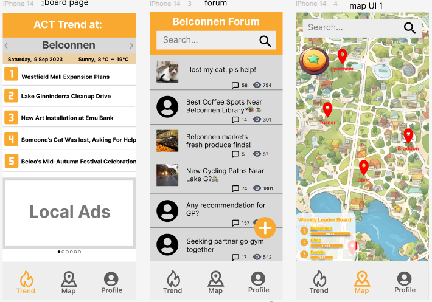

# my_project_showcase
To showcase my projects

# 1. Bupa Medical Appointment Auto-Booking System

## Overview

This project is an automated system designed to refresh and book medical appointments for Bupa. It is developed using Python with Selenium as the primary package, employing ChromeDriver to manage browser interactions. The motivation behind this project was a personal need to secure a medical appointment within 28 days to comply with the requirements of a work visa application. As the earliest available appointments were over a month away, I developed this automation to continually check and secure earlier appointment slots that match my preferred dates. 
I am passionate about applying my technical skills to meaningful tasks.

## Features

- **Automatic Login and Refresh**: Logs into the Bupa portal and refreshes appointment pages.
- **Preference-Based Booking**: Books appointments based on user-specified date preferences.
- **Secure Information Handling**: Uses JSON to securely manage user credentials and preferences.
- **Cloud-Optimized**: Deployed on AWS for enhanced performance and reliability.

## Technologies

- **Python & Selenium**: For scripting and browser automation.
- **ChromeDriver**: Bridges commands between Selenium and Chrome.
- **AWS**: Cloud hosting to ensure continuous operation.

##### The code has been made private to prevent abuse, please contact me if you need anything.

___

# 2. CATAN Dice PC Port

## Overview

This project is a PC port of the classic board game CATAN Dice, developed using Java and JavaFX. The port retains the original charm and fun of the game while incorporating modern aids to enhance player experience. The application facilitates dice rolls, action recording, score tracking, and displays possible moves, significantly enhancing the gameplay.

## Features

- **Dice Rolling**: Automated dice roll functionality to simulate the traditional game experience.
- **Action Recording**: Keeps a log of all player actions throughout the game.
- **Score Calculation**: Automatically calculates and updates scores based on game progress.
- **Guided Actions**: Shows players their possible moves, enhancing strategic decision-making.
- **User-Friendly UI**: Features a clear and intuitive interface that makes navigation and gameplay straightforward.

## Technologies

- **Java**: The core programming language used for building the application.
- **JavaFX**: Utilized for creating a responsive and visually appealing user interface.

## Benefits

The PC version of CATAN Dice allows players to enjoy the game without the need for physical components, making it accessible anytime and enhancing the overall user experience with automated features and a supportive UI.

___
# 3. Robustness Analysis of Canberra's Public Transport Network

## Overview

This project involves a comprehensive robustness analysis of Canberra's public transport network. Using a variety of network analysis metrics, the study assesses the network's resilience to disruptions. Different disruption methods were simulated to evaluate how the network withstands various types of failures.

## Objectives

- **Network Analysis**: Employing various network analysis metrics to understand the structural and operational characteristics of Canberra’s public transport network.
- **Robustness Testing**: Testing the network's robustness under different types of disruptions, such as random failures and targeted attacks.
- **Comparative Study**: Comparing the resilience of the network under different disruption scenarios to identify potential vulnerabilities.

## Methodology

1. **Data Collection**: Gather data on Canberra’s public transport routes and stations.
2. **Network Modeling**: Model the transport network using graph theory, considering buses and stations as nodes and routes as edges.
3. **Robustness Metrics**: Apply metrics like connectivity, betweenness centrality, and network diameter to evaluate the network's robustness.
4. **Disruption Simulation**: Simulate disruptions in the network and observe the impact on overall network performance.

## Technologies Used

- **NetworkX**: A Python library used for the creation, manipulation, and study of the structure, dynamics, and functions of complex networks.
- **Python**: The primary programming language used for data analysis and simulation.

## Results

The analysis provided insights into how the Canberra public transport network can manage disruptions. It was found that while the network has a degree of resilience, certain nodes and links are critical for maintaining network efficiency and should be prioritized for robustness enhancements.

## Conclusion

This study highlights the importance of robustness analysis in public transportation planning and provides a foundational approach for further resilience enhancements in urban transport networks.
___
# 4. Android Mobile Education App

## Overview

This Android application serves as a comprehensive mobile learning platform, offering features tailored for both students and educators. It includes peer-to-peer (P2P) chat functionality, course enrollment, multimedia course content access, forums for each course, and a robust assignment grading section.

## Features

- **P2P Chat**: Allows students and teachers to communicate directly within the app.
- **Course Enrollment**: Users can enroll in courses and access a personalized list of their courses.
- **Multimedia Content**: Each course includes a variety of educational materials such as lecture videos, courseware, and supplementary documents.
- **Course Forums**: Dedicated forums for each course to facilitate discussion and collaboration among students and teachers.
- **Assignment Page**: Displays grades for assignments and lists names of classmates to foster a community learning environment.
- **User Authentication**: Integrated login functionality using Firebase to ensure security and personalize user experience.
- **Database Integration**: Utilizes Firebase to manage user data and course content efficiently.

## Technologies Used

- **Android Studio**: The primary development environment for the application.
- **Firebase**: Used for user authentication, database management, and storage solutions.
- **Java**: Used for whole app's framework.

## Conclusion

This Android application provides an engaging and interactive educational experience, leveraging modern technology to enhance learning and teaching processes. It is designed to be intuitive and accessible, making it ideal for students and educators seeking a flexible learning environment.
***

# 5. Robotic Multi-jointed Arm Motion Simulation

## Overview

This project focuses on simulating the motion of a multi-jointed robotic arm in a 2D environment. Using Java, advanced algorithms were implemented to calculate the pathfinding from one state to another, navigating around obstacles efficiently.

  
  

## Key Features

- **Advanced Pathfinding**: Implements sophisticated algorithms to determine the optimal route for the robotic arm from a starting position to a designated end position within a 2D space.
- **Obstacle Avoidance**: Equipped with functionality to avoid obstacles, ensuring smooth and feasible movements of the robotic arm.
- **Simulation**: Provides a visual simulation of the arm's movements, illustrating the calculated path and interactions with the environment.
- **Research and Analysis**: Includes extensive research and a detailed report on the algorithms' feasibility, efficiency, and outcomes in various scenarios.

## Technologies Used

- **Java**: The core programming language used for developing the simulation and algorithmic calculations.

***

# 6. Project Grover - Large-Scale Drawing Robot

## Overview

Project Grover is a collaborative, client-driven project aimed at constructing a large-scale drawing robot. As the team leader and spokesperson, I managed project coordination, client communication, and led the majority of the hardware assembly and testing. Our robot utilizes GPS-RTK positioning to accurately execute drawing tasks over large areas.

## Key Responsibilities

- **Project Management**: Oversaw the project timeline, resource allocation, and team coordination to meet client objectives.
- **Client Communication**: Acted as the primary liaison between the team and the client, ensuring requirements were clearly understood and met.
- **Hardware Assembly and Testing**: Led the design, assembly, and rigorous testing of the robot's hardware components.
- **Software Development**: Contributed to the development of accompanying software that translates vector images into geographically mapped waypoints for the robot.

## Features

- **GPS-RTK Positioning**: Enables high-precision geolocation to ensure accuracy in drawing over extensive areas.
- **Vector Image Input**: Accepts vector images which are then converted into a set of waypoints that guide the robot's movements.
- **Path Generation Software**: Utilizes Google Maps API and custom algorithms to convert images into navigable paths.
- **Real-Time Monitoring**: Integrated software developed in Qt for real-time tracking and operation control.

## Technologies Used

- **Python**: For scripting and automation of the drawing path calculations.
- **Google Maps API**: For mapping vector paths to real-world geographic locations.
- **Qt**: Used for developing the user interface for real-time control and monitoring.
- **Ardupilot**: Customized flight controller software adapted for ground-based robotic control.
- **C++**: For modifying and understanding the Ardupilot source code.
- **Computer Vision**: Implemented for path recognition and obstacle avoidance.
***

# 7. Your Say Game - Enhancing Community Engagement through Gamification

## Overview

"Your Say Game" is a conceptual mobile application designed to boost community engagement in urban planning in the Australian Capital Territory (ACT). This project serves as a showcase of how gamification can be integrated into public engagement strategies to make participation more interactive and rewarding. The application encourages residents to actively participate in urban planning through a user-friendly and engaging platform.

## Key Features

- **User Registration and Profile Management**: Users can register and manage their profiles, tailoring their interaction based on personal information and preferences.
- **Local Trends and Community Forum**: Provides a platform for users to engage with local trends and participate in forums, enhancing community discussion and collaboration.
- **Interactive Cartoon Map**: Features a gamified and interactive map of Canberra, allowing users to explore different community issues and activities.
- **Mini-game Feature**: Includes "My Garden", a mini-game that engages users by rewarding their participation with virtual goods.
- **Reward System**: A dynamic reward system that incentivizes continued app engagement with both virtual and real-world benefits.

## My Contributions

As the lead designer of the "Your Say Game" concept, my responsibilities included:

- **App Conceptualization**: I was responsible for conceptualizing the overall application design, including its use case scenarios and gamification strategy to engage users effectively.
- **UI/UX Design**: I designed the entire app interface, focusing on user experience to ensure the app is accessible, intuitive, and engaging.
- **Technological Planning**: I planned the integration of various technologies such as AI for analyzing user interactions and advanced data analytics for tailoring content and advertisements.
- **Feasibility Study**: Conducted extensive research to ensure the app's design is feasible and effective within the context of ACT's urban planning needs.

## Achievements

This project was the **Runner-Up at the Responsible Innovation Hackathon 2023**, hosted by the Canberra Innovation Network (CBRIN). 

## Acknowledgements

This project was developed as part of the 'Responsible Innovation Project' under the guidance of Dr. Ehsan Nabavi at the Australian National University. Special thanks to our client partners and all team members who contributed to the development and success of this project.

